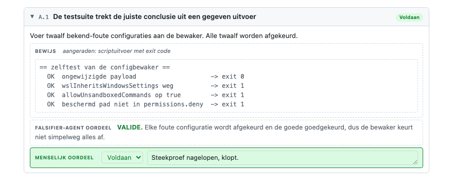

# Acceptatiecriteria en bewijs

Een invulbaar HTML-document dat per acceptatiecriterium vastlegt welk bewijs er is geleverd en hoe
dat beoordeeld is. Voor criteria die niet alleen afgevinkt maar aantoonbaar moeten zijn: een ander
moet later kunnen nalopen waaróp het groene vinkje is gebaseerd.

De criteria in `template.html` zijn een voorbeeldset. Vervang ze door je eigen criteria; de
structuur eromheen is het template.

## Voorbeeld van een ingevulde check

## Soorten bewijs

- **Script uitvoer** — De letterlijke uitvoer van een controle-script. Heeft de voorkeur: er komt
  geen oordeel aan te pas.
- **Bewijsbestanden** — Wat niet als tekst te vangen is: screenshot, korte gif, logbestand. Liever
  gif dan video (zwaar, deelt lastig). Kan de agent het niet zelf vastleggen, dan levert een
  persoon het aan.
- **Agent-bevindingen** — Voor wat niet programmatisch kan: een agent met verse context kijkt
  objectief naar code, gedrag of beelden; een falsifier-subagent probeert de bevindingen daarna te
  weerleggen. Zie [AGENTS.md](AGENTS.md#agent-bevindingen).

## Soorten oordelen

- **Falsifier-agent oordeel** — Een aparte agent met verse context probeert het bewijs onderuit te
  halen. Uitkomst: VALIDE of WEERLEGD.
- **Menselijk oordeel** — De eindbeoordeling door een mens: voldaan, werk nodig of niet voldaan.

## Runs en uitrol-checklist

Eén ingevuld document = één verificatierun: één machine of omgeving, één uitvoerder. Aangeraden:
doe voor elke machine of omgeving waar je naar uitrolt (test, pre-productie, een andere laptop)
een nieuwe run, en vul het template dus opnieuw volledig in.

Maak daarnaast een uitrol-checklist die over het geheel van runs gaat. **Voorbeeld** — een sandbox
uitrollen naar het hele team, dus niet alleen op je eigen laptop getest maar ook op die van een
ander:

- [ ] Run 1 is afgerond: elk criterium heeft bewijs en een menselijk oordeel.
- [ ] Run 2 is uitgevoerd op een **andere machine** door een **andere persoon**, met hetzelfde resultaat.
- [ ] De scriptuitvoer van beide runs toont een **verschillende hostname**; de tweede machine is daarmee aantoonbaar.
- [ ] Niet-voldane criteria zijn belegd bij een eigenaar of geaccepteerd als restrisico.
- [ ] Sign-off door de eigenaar van de uitrol.

Laat het verificatiescript als eerste regels hostname, OS-versie, gebruiker en het controlegetal
van de build (image-digest) printen: dan is de machine aantoonbaar uit de uitvoer zelf. Wat een
script niet kan vastleggen, krijgt een ondertekeningsveld met naam en datum.

## Verder lezen

- [`AGENTS.md`](AGENTS.md) — de prompts voor de invulagent en de falsifier-subagent, en waarom dat
  twee gescheiden agents met verse context zijn.
- [`evidence-best-practices.md`](evidence-best-practices.md) — welke bewijsvormen sterk zijn, wat
  alleen een mens kan, en waar het misgaat (reward hacking, claimbare criteria).

## Gebruik

1. Open `template.html` in een browser; geen server of dependencies nodig.
2. Vul de velden bovenaan in, pas de criteria aan, plak bewijs en sleep bestanden naar de dropzones.
3. Klik op **Bewaar als bestand** voor een standalone kopie met alles erin.

## Twee regels die ertoe doen

- **Bewijs is een verwijzing, geen bewering.** "Getest en werkt" is geen bewijs; uitvoer of een
  bestand wel, want een ander kan die nalopen.
- **Wie het bewijs invult, beoordeelt het niet.** Anders keurt de invuller zijn eigen werk goed.
