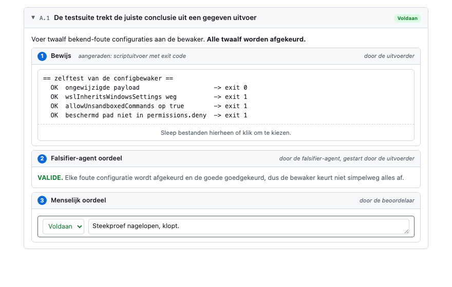

# Acceptatiecriteria, bewijs en oordeel

Een invulbaar HTML-document dat per acceptatiecriterium vastlegt welk bewijs er is geleverd en hoe
dat beoordeeld is. Voor criteria die niet alleen afgevinkt maar aantoonbaar moeten zijn: een ander
moet later kunnen nalopen waarop het groene vinkje is gebaseerd.

De criteria in `template.html` zijn een voorbeeldset. Vervang ze door je eigen criteria; de
structuur eromheen is het template.

## Voorbeeld van een ingevulde check

## Soorten bewijs

- **Script uitvoer.** De letterlijke uitvoer van de test of het script dat de controle uitvoert. Dit heeft de voorkeur, want
  er komt geen oordeel aan te pas. Zie de
  [sterkte van bewijsvormen](references/evidence-best-practices.md#sterkte-van-bewijsvormen-van-sterk-naar-zwak).
- **Bewijsbestanden.** Wat niet als tekst te vangen is: screenshot, korte gif, logbestand. Liever
  gif dan video, want video is zwaar en deelt lastig. Kan de agent het niet zelf vastleggen, dan
  levert een persoon het aan.
- **Agent-bevindingen.** Voor wat niet programmatisch kan. Een agent met verse context kijkt
  objectief naar code, gedrag of beelden; een falsifier-subagent probeert de bevindingen daarna te
  weerleggen. Zie [AGENTS.md](AGENTS.md#agent-bevindingen) en de
  [randvoorwaarden](references/evidence-best-practices.md#drie-valkuilen).

## Soorten oordelen

- **Falsifier-agent oordeel.** Een aparte agent met verse context probeert het bewijs onderuit te
  halen. Uitkomst: VALIDE of WEERLEGD. Zie
  [de agent-instructie](AGENTS.md#2-bewijs-controleren-via-falsifier-subagent).
- **Menselijk oordeel.** De eindbeoordeling door een mens: voldaan, werk nodig of niet voldaan.

## Runs en uitrol-checklist

Een ingevuld template heet een **run-document**: één run, op één machine of omgeving, door één
uitvoerder. Rol je bijvoorbeeld uit naar meerdere machines of omgevingen (test, pre-productie,
een andere laptop), dan krijgt elke machine of omgeving een eigen run-document.

Een uitrol-checklist gaat over het geheel van runs. Voorbeeld, voor een sandbox die naar het hele
team gaat:

- [ ] Run 1: elk criterium heeft bewijs en een menselijk oordeel.
- [ ] Run 2: andere machine, andere persoon, zelfde resultaat.
- [ ] De scriptuitvoer van beide runs toont een verschillende hostname.
- [ ] Niet-voldane criteria zijn belegd bij een eigenaar of geaccepteerd als restrisico.
- [ ] Sign-off door de eigenaar van de uitrol.

Laat het script als eerste regels hostname, OS-versie, gebruiker en image-digest printen; de
machine blijkt dan uit de uitvoer zelf. Wat een script niet kan vastleggen, krijgt een
ondertekeningsveld met naam en datum.

**Machine (hostname) achterhalen.** Draai `hostname` in een terminal; werkt
op Windows, macOS en Linux. Of laat je agent het doen: "Vul in het run-document het veld Machine
(hostname) in met de uitvoer van `hostname`." Handmatig overtypen kan, maar het liefst vult het
script of de agent het in.

## Verder lezen

- [`AGENTS.md`](AGENTS.md): de prompts voor de invulagent en de falsifier-subagent, en waarom dat
  twee gescheiden agents met verse context zijn.
- [`references/evidence-best-practices.md`](references/evidence-best-practices.md): welke bewijsvormen sterk zijn, wat
  alleen een mens kan, en waar het misgaat.

## Gebruik

1. Open `template.html` in een browser; geen server of dependencies nodig.
2. Vul de velden bovenaan in, pas de criteria aan, plak bewijs en sleep bestanden naar de
   dropzones.
3. Klik op **Bewaar als bestand** voor een standalone kopie met alles erin.
